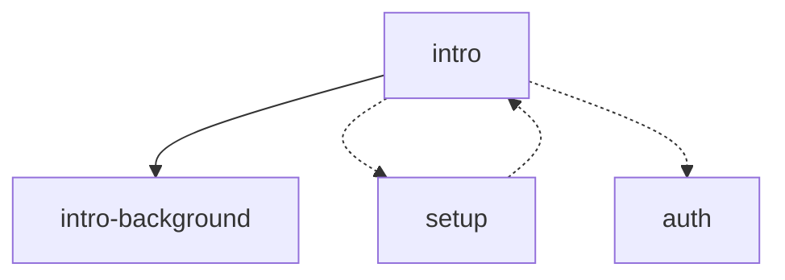
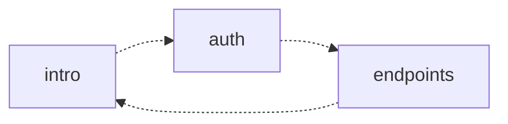

# IATF Graph Command Proposals

This document outlines several proposed output formats for the new `iatf graph` command, designed to help AI agents understand the relationship between sections in an IATF file.

The graph includes two types of relationships:
1. **Hierarchy**: Parent-child relationships defined by nesting in the CONTENT section.
2. **References**: Cross-references made via the `{@section-id}` syntax.

---

## Proposal 1: JSON (Structured & Comprehensive)

Best for programmatic use by agents or integration into other tools.

### Example Output
```json
{
  "file": "document.iatf",
  "nodes": [
    {
      "id": "intro",
      "title": "Introduction",
      "summary": "Overview of the project",
      "level": 1,
      "children": ["intro-background"],
      "references": ["setup", "auth"]
    },
    {
      "id": "intro-background",
      "title": "Background",
      "summary": "History and motivation",
      "level": 2,
      "parent": "intro",
      "children": [],
      "references": []
    },
    {
      "id": "setup",
      "title": "Setup",
      "summary": "Installation instructions",
      "level": 1,
      "children": [],
      "references": ["intro"]
    }
  ],
  "adjacency_list": {
    "intro": ["intro-background", "setup", "auth"],
    "intro-background": [],
    "setup": ["intro"]
  }
}
```

---

## Proposal 2: Compact Text (Token Efficient)

Designed to give the agent a quick "mental map" using the minimum number of tokens. It uses a custom notation to distinguish hierarchy and references.

### Legend
- `A -> B` : A contains B (Hierarchy)
- `A => B` : A references B (Cross-reference)

### Example Output
```text
@graph: document.iatf
[intro] -> [intro-background]
[intro] => [setup], [auth]
[intro-background]
[setup] => [intro]
[auth]
```

---

## Proposal 3: Mermaid (Visualization Friendly)

Useful because many modern LLMs can render or interpret Mermaid diagrams directly, and it's great for human-readable documentation.

### Example Output


---

## Proposal 4: Detailed Markdown Table

Provides a clear overview of "Incoming" and "Outgoing" connections for each section.

### Example Output

| Section ID | Contains (Children) | References (Outgoing) | Referenced By (Incoming) |
|------------|---------------------|-----------------------|-------------------------|
| `intro`    | `intro-background`  | `setup`, `auth`       | `setup`                 |
| `intro-background` | (none)      | (none)                | `intro` (parent)        |
| `setup`    | (none)              | `intro`               | `intro`                 |

---

## Logic and Implementation Details

1. **Extraction**:
   - Hierarchy is extracted during the parsing of section nesting.
   - References are extracted using the existing `extractReferences` logic which ignores code blocks.

2. **Bidirectional Mapping**:
   - The tool will maintain a reverse index of references to answer "where is this section referenced?".

3. **Flags**:
   - `iatf graph <file> --format [json|text|mermaid|table]`
   - `iatf graph <file> --depth [1|2]` (to limit to main sections or include subsections)
   - `iatf graph <file> --types [all|hierarchy|references]`

## Comparison for AI Agents

| Format | Token Efficiency | Parsability | Contextual Richness |
|--------|------------------|-------------|---------------------|
| **JSON** | Low (High Verbosity) | Excellent | High |
| **Compact** | Excellent | Good | Medium |
| **Mermaid** | Medium | Good | Medium |
| **Table** | Medium | Good | High |

---

## Use Case Examples

### Case 1: All Sections (Main + Subsections)
This shows the full granularity of the document.

**JSON Output:**
```json
{
  "nodes": [
    {"id": "auth", "level": 1, "children": ["auth-key", "auth-oauth"]},
    {"id": "auth-key", "level": 2, "parent": "auth"},
    {"id": "auth-oauth", "level": 2, "parent": "auth"}
  ]
}
```

**Compact Output:**
```text
[auth] -> [auth-key], [auth-oauth]
[auth-key]
[auth-oauth]
```

### Case 2: Main Sections Only (`--depth 1`)
Useful for a high-level overview of a massive document. Subsections are hidden, and references between children of different parents are aggregated to the parent level.

**JSON Output:**
```json
{
  "nodes": [
    {"id": "auth", "level": 1, "children": []},
    {"id": "endpoints", "level": 1, "children": []}
  ]
}
```

**Compact Output:**
```text
[auth] => [endpoints]
[endpoints] => [auth]
```

### Case 3: Only References (`--types references`)
Hides hierarchy to focus purely on how concepts are interlinked.

**Mermaid Output:**

