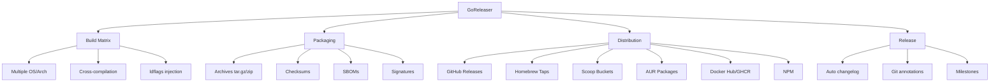

# GoReleaser Analysis for IATF Project

## Current Build & Release Approach

Your current setup uses a **custom GitHub Actions workflow** ([`.github/workflows/release.yml`](.github/workflows/release.yml:1)) that manually:

1. **Builds** 5 platform binaries (Windows amd64, macOS amd64/arm64, Linux amd64/arm64)
2. **Copies** install scripts to dist
3. **Generates** SHA256 checksums manually
4. **Creates** GitHub release with `softprops/action-gh-release`
5. **Maintains** separate install scripts in `installers/` directory

### Current Workflow Pain Points

| Aspect | Current State |
|--------|---------------|
| Build matrix | Hardcoded shell commands |
| Checksums | Manual `sha256sum` generation |
| Release notes | Hand-written in workflow YAML |
| Version management | Reads from `VERSION` file manually |
| ldflags | Manually constructed string |
| Installers | Separate scripts to maintain |
| Changelog | Manual or git-based only |
| Homebrew tap | Not supported |
| Docker images | Not supported |
| Signing | Not implemented |

---

## What is GoReleaser?

**GoReleaser** is a release automation tool for Go projects. It handles the entire release lifecycle through a single configuration file (`.goreleaser.yaml`).

### Core Capabilities



---

## Detailed Comparison

### 1. Build Configuration

| Feature | Current | GoReleaser |
|---------|---------|------------|
| **Matrix definition** | Shell script lines 27-51 | YAML `builds:` section with `goos`/`goarch` lists |
| **ldflags** | Manual string construction | Template-driven: `-ldflags="-s -w -X main.Version={{.Version}}"` |
| **Parallel builds** | Sequential | Concurrent by default |
| **Build hooks** | Not available | Pre/post build hooks supported |
| **Conditional builds** | Manual `if` statements | `ignore:` matrix to skip combinations |

**Example GoReleaser build config:**
```yaml
builds:
  - id: iatf
    main: ./go
    binary: iatf
    goos:
      - linux
      - darwin
      - windows
    goarch:
      - amd64
      - arm64
    ldflags:
      - -s -w -X main.Version={{.Version}} -X main.Commit={{.Commit}} -X main.Date={{.Date}}
    env:
      - CGO_ENABLED=0
```

### 2. Archive & Packaging

| Feature | Current | GoReleaser |
|---------|---------|------------|
| **Archive formats** | Raw binaries only | tar.gz, zip, deb, rpm, apk |
| **Naming template** | Hardcoded | Customizable: `{{.ProjectName}}_{{.Version}}_{{.Os}}_{{.Arch}}` |
| **Extra files** | Manual copy | `files:` glob patterns |
| **Wrap in directory** | No | Built-in support |

### 3. Checksums & Signing

| Feature | Current | GoReleaser |
|---------|---------|------------|
| **Checksum file** | Manual `sha256sum` | Auto-generated, customizable algorithm |
| **Signing** | Not implemented | Cosign, GPG, or custom |
| **SBOM** | Not implemented | Syft integration |

### 4. Release Distribution

| Feature | Current | GoReleaser |
|---------|---------|------------|
| **GitHub Releases** | `softprops/action-gh-release` | Native, more control |
| **Release notes** | Hardcoded template | Auto-generated from commits, customizable |
| **Draft releases** | Not supported | Built-in |
| **Prerelease** | Not supported | Built-in |
| **Milestones** | Not supported | Auto-close on release |

### 5. Package Managers

| Feature | Current | GoReleaser |
|---------|---------|------------|
| **Homebrew** | Not supported | Auto-generate formula, push to tap repo |
| **Scoop** | Not supported | Auto-generate manifest |
| **AUR** | Not supported | Auto-generate PKGBUILD |
| **NPM** | Not supported | Publish as npm package |
| **Snap** | Not supported | Build and publish snaps |

### 6. Docker Support

| Feature | Current | GoReleaser |
|---------|---------|------------|
| **Docker images** | Not supported | Multi-arch builds, manifest creation |
| **GHCR/Docker Hub** | Not supported | Push to multiple registries |

---

## Key Benefits of GoReleaser for IATF

### Immediate Benefits

1. **Simplified Configuration**
   - Single `.goreleaser.yaml` instead of 147-line workflow file
   - Declarative vs imperative approach
   - Easier to read and maintain

2. **Better Release Notes**
   - Auto-generated from git commits
   - Group by type (feat, fix, docs)
   - Links to PRs and authors

3. **Homebrew Support**
   ```yaml
   brews:
     - repository:
         owner: Winds-AI
         name: homebrew-tap
       folder: Formula
       homepage: https://github.com/Winds-AI/agent-traversal-file
       description: IATF - Intelligent Agent Traversal Format
   ```
   Users could install with: `brew install winds-ai/tap/iatf`

4. **Checksum & Signing**
   - Automatic SHA256 generation
   - Cosign integration for keyless signing
   - Provenance attestation

5. **Archive Packaging**
   - Wrap binaries in versioned directories
   - Include LICENSE, README automatically
   - Cleaner user experience

### Advanced Benefits

6. **Scoop for Windows**
   - Windows users: `scoop install iatf`
   - Auto-updates via `scoop update`

7. **Docker Images**
   - `docker pull ghcr.io/winds-ai/iatf:latest`
   - Useful for CI/CD pipelines

8. **Changelog Generation**
   - Group changes by type
   - Filter out specific commits
   - Customizable templates

9. **Announcements**
   - Post to Slack, Discord, Twitter on release
   - Webhook support

---

## Migration Path

### Option 1: Minimal Migration (Keep Current Features)

Replace your workflow with GoReleaser doing essentially the same thing:

```yaml
# .goreleaser.yaml
version: 2
project_name: iatf

before:
  hooks:
    - go mod tidy -C go

builds:
  - id: iatf
    dir: go
    main: .
    binary: iatf
    goos:
      - linux
      - darwin
      - windows
    goarch:
      - amd64
      - arm64
    ldflags:
      - -s -w -X main.Version={{.Version}}
    env:
      - CGO_ENABLED=0

archives:
  - format: binary
    name_template: "{{.ProjectName}}-{{.Os}}-{{.Arch}}"
    replacements:
      amd64: amd64
      arm64: arm64
      darwin: darwin
      linux: linux
      windows: windows

checksum:
  name_template: 'SHA256SUMS'
  algorithm: sha256

release:
  github:
    owner: Winds-AI
    name: agent-traversal-file
  draft: false
  prerelease: auto

changelog:
  sort: asc
  filters:
    exclude:
      - '^docs:'
      - '^test:'
      - '^chore:'
  groups:
    - title: Features
      regexp: "^.*feat[(\\w)]*:+.*$"
      order: 0
    - title: 'Bug fixes'
      regexp: "^.*fix[(\\w)]*:+.*$"
      order: 1
    - title: Others
      order: 999
```

### Option 2: Enhanced Migration (Recommended)

Add Homebrew, proper archives, and signing:

```yaml
# .goreleaser.yaml
version: 2
project_name: iatf

before:
  hooks:
    - go mod tidy -C go

builds:
  - id: iatf
    dir: go
    main: .
    binary: iatf
    goos: [linux, darwin, windows]
    goarch: [amd64, arm64]
    ldflags:
      - -s -w -X main.Version={{.Version}} -X main.Commit={{.Commit}} -X main.Date={{.Date}}
    env:
      - CGO_ENABLED=0

archives:
  - format: tar.gz
    format_overrides:
      - goos: windows
        format: zip
    name_template: "{{.ProjectName}}_{{.Version}}_{{.Os}}_{{.Arch}}"
    files:
      - LICENSE
      - README.md
      - src: installers/install.sh
        dst: install.sh
        strip_parent: true
      - src: installers/install.ps1
        dst: install.ps1
        strip_parent: true

checksum:
  name_template: 'SHA256SUMS'

signs:
  - artifacts: checksum
    args: ["--batch", "-u", "{{ .Env.GPG_FINGERPRINT }}", "--output", "${signature}", "--detach-sign", "${artifact}"]

brews:
  - repository:
      owner: Winds-AI
      name: homebrew-tap
    folder: Formula
    homepage: https://github.com/Winds-AI/agent-traversal-file
    description: IATF - Intelligent Agent Traversal Format CLI
    license: MIT
    test: |
      system "#{bin}/iatf --version"

scoop:
  bucket:
    owner: Winds-AI
    name: scoop-bucket
  homepage: https://github.com/Winds-AI/agent-traversal-file
  description: IATF - Intelligent Agent Traversal Format CLI
  license: MIT

changelog:
  use: github
  sort: asc
  filters:
    exclude:
      - '^docs:'
      - '^test:'
      - '^chore:'
      - '^ci:'
  groups:
    - title: Features
      regexp: "^.*feat[\\w]*:+.*$"
      order: 0
    - title: Bug Fixes
      regexp: "^.*fix[\\w]*:+.*$"
      order: 1
    - title: Documentation
      regexp: "^.*docs[\\w]*:+.*$"
      order: 2
    - title: Other
      order: 999
```

### New GitHub Actions Workflow

```yaml
# .github/workflows/release.yml
name: Release

on:
  push:
    tags:
      - 'v*'

permissions:
  contents: write
  packages: write

jobs:
  release:
    runs-on: ubuntu-latest
    steps:
      - uses: actions/checkout@v4
        with:
          fetch-depth: 0

      - uses: actions/setup-go@v5
        with:
          go-version: stable

      - name: Run GoReleaser
        uses: goreleaser/goreleaser-action@v6
        with:
          distribution: goreleaser
          version: '~> v2'
          args: release --clean
        env:
          GITHUB_TOKEN: ${{ secrets.GITHUB_TOKEN }}
          # For Homebrew/Scoop taps (if using):
          # TAP_GITHUB_TOKEN: ${{ secrets.TAP_GITHUB_TOKEN }}
```

---

## Summary Table: Current vs GoReleaser

| Capability | Current | GoReleaser Minimal | GoReleaser Full |
|------------|---------|-------------------|-----------------|
| Multi-platform builds | ✅ Manual | ✅ Declarative | ✅ Declarative |
| Checksums | ✅ Manual | ✅ Auto | ✅ Auto |
| Release notes | ⚠️ Template | ✅ Auto from commits | ✅ Grouped by type |
| Homebrew formula | ❌ | ❌ | ✅ Auto-generated |
| Scoop manifest | ❌ | ❌ | ✅ Auto-generated |
| Archive packaging | ❌ (raw bins) | ✅ Configurable | ✅ With extra files |
| Signing | ❌ | ❌ | ✅ Cosign/GPG |
| SBOM | ❌ | ❌ | ✅ Syft |
| Docker images | ❌ | ❌ | ✅ Multi-arch |
| Changelog | ❌ | ✅ Basic | ✅ Advanced grouping |
| Announcements | ❌ | ❌ | ✅ Slack/Discord/etc |

---

## Recommendation

For IATF, I recommend **Option 2 (Enhanced Migration)** because:

1. **Homebrew support** significantly improves macOS user experience
2. **Proper archives** with LICENSE/README look more professional
3. **Auto-generated changelogs** save time and improve transparency
4. **Future-proof**: Easy to add Docker, signing later
5. **Maintained tool**: GoReleaser is actively developed with a large community

### Effort Required

- **Initial setup**: ~1 hour (create config, test with `--snapshot`)
- **Homebrew tap**: ~30 min (create separate repo, add token)
- **Testing**: ~30 min (verify all artifacts)
- **Total**: ~2 hours one-time investment

### Long-term Savings

- No more manual release note writing
- No more install script maintenance for package managers
- Automatic changelog generation
- One command to release: `git tag v1.2.3 && git push origin v1.2.3`
